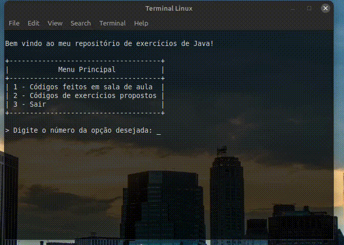

# JavaLearn

### ✨ Demo



## 🛠 Installation

```
git clone https://github.com/LopesLs/JavaLearn.git
mvn package
java -jar target/javalearn-1.0-SNAPSHOT.jar
```

## ⌨️ Usage

```shell script
Usage: JavaLearn [OPTIONS]

Options:
  1 INT      Códigos de sala de aula
  2 INT      Códigos de exercícios
  3 INT      Fechar o programa
```

## 🥼 Run tests

```shell script
mvn test-compile
```

## ✍️ Author

👤 **Carlos Lopes**

* Linkedin: <a href="https://www.linkedin.com/in/lopeslsdev/" target="_blank">@Carlos Lopes</a>
* Email: lopes.carlos.host@gmail.com

Feel free to ping me 😉